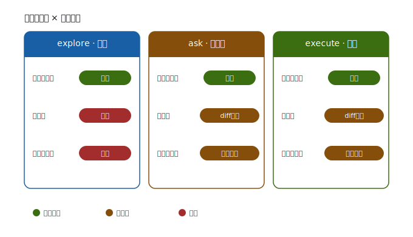

# 权限模式与内置指令详解

本文详细说明 DeepSeek Code Agent 的**权限三模式**，以及它提供的 **15 个内置指令（工具）**的具体功能与风险级别。

## 一、权限三模式

权限模式控制 Agent 在每一步动作前是否需要人工介入。三种模式定义在 `src/agent/loop.ts`，可在运行时用 `/mode explore|ask|execute` 切换。

一句话类比：就像给一个实习生批权限——`explore` 只让看不让碰，`ask` 改动前先问你，`execute` 放手让他干但有两条红线必须你签字。

### 1. explore（只读）
任何风险不是 `low` 的工具调用一律拦截。只允许"看"类动作（读文件、代码搜索、只读命令），凡是会落盘（文件写）或高危（`run_command` 破坏性）的全部拒绝。适合"先让 Agent 摸清项目结构、别乱动"的侦查阶段。

### 2. ask（需确认）
最稳的"人在回路"模式，每步都让你把关：
- 文件写类工具（`create_file` / `edit_file` / `delete_file`）执行前先展示 **diff** 等你确认；
- 破坏性命令强制确认；
- 只有低风险、非破坏性动作自动放行。

### 3. execute（自动执行）
绝大多数动作自动跑，但有两条**不可绕过的红线**：
- ① 破坏性命令（如 `rm -rf`、`git push --force`）强制确认；
- ② 文件写类工具即便在 `execute` 模式下**照样要 diff 确认**——因为写盘不可逆。

> ⚠️ `execute` ≠ 完全放飞。它只省掉了"低风险动作"和"非破坏性命令"的确认，文件落盘和删库/强推这类不可逆操作仍是你点头才算数。

**默认与切换**：TUI 启动时的默认模式在 `src/cli/app.tsx`——配了 reasoner 模型就默认 `ask`，否则 `execute`。运行中使用 `/mode` 可在三档间实时切换。

## 二、内置指令（工具）一览

共 15 个工具，分四组。风险级别对应权限模式的拦截/确认逻辑。

### 基础文件操作（7）
| 指令 | 功能 | 风险 |
|------|------|------|
| `read_file` | 读取文件内容（支持 `offset` / `limit`） | 低 |
| `create_file` | 新建文件 | 中 |
| `edit_file` | 字符串替换修改文件（修改前展示 diff 供确认） | 中 |
| `delete_file` | 删除文件（需确认，不可恢复） | 高 |
| `run_command` | 执行 shell 命令，返回 stdout / stderr / 退出码 | 高（危险命令需确认） |
| `search_code` | 在代码库中正则搜索 | 低 |
| `awaitUser` | 执行中途向用户提问，等待回复后继续当前任务 | 低 |

### Git（3）
| 指令 | 功能 | 风险 |
|------|------|------|
| `git_status` | 查看工作区状态 | 低 |
| `git_diff` | 查看改动 | 低 |
| `git_commit_msg` | 根据 diff 生成中文提交信息 | 低（复合工具） |

### 中文分析与发现（4，复合工具）
| 指令 | 功能 | 风险 |
|------|------|------|
| `review_code` | 中文代码审查报告（风险等级 + 逐条建议） | 低 |
| `audit_dependencies` | 中文依赖安全审计（漏洞 / 恶意包 / 升级建议） | 低 |
| `terminology` | 中英术语对照（读英文文档时映射中文译名） | 低 |
| `project_discover` | 扫描项目结构，生成中文项目地图 | 低 |

### 子 Agent 委派（1）
| 指令 | 功能 | 风险 |
|------|------|------|
| `delegate` | 派发子 Agent 执行独立子任务（上下文隔离），结果回灌主对话 | 低 |
