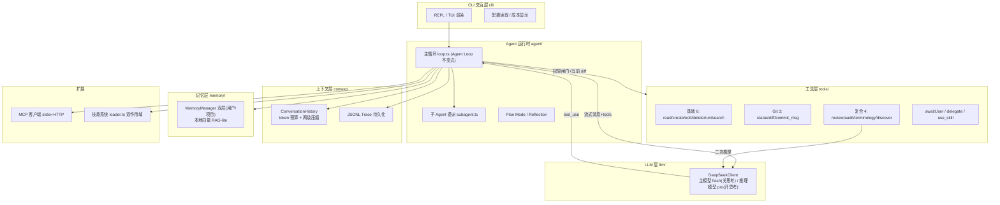

# DeepSeek Code Agent — 面试讲解拆解

> 用途：把你这个项目的"技术能力与项目价值"整理成一套可在面试中流畅讲述的脚本。
> 用法建议：先背熟第 0 节"电梯演讲"，再按 1→6 的顺序展开；第 7 节是面试官高频追问的应答要点，可临场调用。
> 全文以"讲述口吻"写成，方括号里是给你自己的提示，不是要念出来的内容。

---

## 0. 电梯演讲（30 秒版，建议开场直接说）

> "我做了一个**直连 DeepSeek 官方 API 的中文编程 Agent CLI**。一句话概括：它把 DeepSeek 当成一等公民来设计 Harness，在中文工程语境下替开发者做代码阅读、编辑、运行、审查、依赖审计这类事，还能记住项目约定、按需加载可复用工作流。
>
> 应用场景很直接——海外主流 Agent（比如 Claude Code）默认是英文、且面向英文工程习惯；我在中文团队里用它们做代码审查、读英文文档、写中文提交信息，总得在提示词里反复补'请用中文'。这个项目的出发点，就是**把'中文优先'做进 Harness 本身**，而不是靠提示词补丁。"

[提示：这一句同时交代了"目标 + 差异化 + 动机"，是后面所有内容的锚点。]

---

## 1. 项目概述

**一句话目标（可写在简历/开头）：**
> 一个把 DeepSeek V4 作为一等公民设计的、中文优先的编程 Agent CLI，提供代码读写改删、命令执行、中文代码审查、依赖安全审计、Git 集成、会话记忆与可复用技能等能力。

**应用场景（挑 2~3 个讲，别全念）：**
- 中文开发者日常：让 Agent 用中文读代码、改代码、跑命令、写中文提交信息、做中文代码审查。
- 读英文技术文档/开源仓库时：用 `terminology` 做中英术语对照，用 `project_discover` 一键生成项目结构地图。
- 工程可信：文件写操作有"写前 diff 审批 + 权限三模式"，长任务有上下文压缩与防死循环，会话可恢复、成本可追踪。

**为什么值得做（价值定位，回答"你为什么不直接用现成的"）：**
- 不是又套一层 LangChain。项目的核心是**手写 Harness**——即 Agent 循环、工具调度、上下文与权限治理这套"壳"，模型是 DeepSeek 而不是 GPT/Claude。
- 这带来两个教学/工程价值：① 真正理解 Agent 的"Agentic 能力来自模型训练、工程价值在 Harness"这一结论；② 中文语境的工程能力（审查/审计/术语/提交信息）是通用 Agent 默认缺位的，属于差异化。

---

## 2. 技术架构

整体是**分层 + 单一 Agent Loop 驱动**的结构。最上面是 CLI 交互层，中间是 Agent 运行时（核心循环），往下是 LLM 封装、工具层、上下文层、记忆层，旁边挂 MCP 与技能系统，所有关键事件落 JSONL Trace。

**核心模块职责（面试时按顺序点一遍即可）：**
- **cli/**：REPL、Markdown 渲染、`.env` 配置读取、`/cost` 成本展示、命令分派。
- **agent/**：项目的心脏。`loop.ts` 实现 Agent Loop；`subagent.ts` 派生子 Agent（上下文隔离）；`system-prompt.ts` 注入系统提示；`output-style.ts` 控制最终答复口吻。
- **llm/**：`deepSeekClient` 封装官方 API，做**双模型路由**、流式解析、tool_calls 增量拼接、用量与成本统计。
- **tools/**：所有能力的落点。统一 `ToolDef` 抽象（name/description/parameters/risk/execute/preview），含安全护栏与写前 diff 预览。
- **context/**：`ConversationHistory` 管多轮历史与压缩；`trace.ts` 把每次会话写成 JSONL 可重放。
- **memory/**：双层记忆（用户级 `~/.dsa/memory` + 项目级 `<cwd>/.dsa/memory`），本地轻量向量检索，对标 Claude Code 的 CLAUDE.md 双层记忆。
- **mcp/**：MCP 客户端，支持 stdio + Streamable HTTP，可接外部工具服务器。
- **skills/**：项目级 + 全局级技能，模型按需 `use_skill` 加载完整工作流。

**一次典型交互的数据流（讲"交互关系"时最有用）：**
用户输入 → `loop.ts` 把历史+系统提示+工具清单发给主模型（flash，关思考）→ 模型返回文本和/或 `tool_use` → 经过权限闸门（explore/ask/execute，文件写还要 diff 审批）→ 执行工具，结果**先按预算裁剪**再回灌历史 → 循环继续，直到模型不再调工具。复合工具（审查/审计…）在内部用推理模型（pro，开思考）做第二次推理，但不带工具、不会触发新循环。

---

## 3. 技术亮点

这一节是"秀肌肉"的地方，但要用**工程语言**讲，别堆名词。每条都给"它解决了什么"。

**① 双模型 V4 策略（成本与质量的分工）**
- 主循环用 `deepseek-v4-flash`：关思考（`thinking={type:'disabled'}`）、`temperature=0.1` 保证工具选择确定性、响应快、便宜。
- 重分析（代码审查/依赖审计/术语/项目发现/提交信息）用 `deepseek-v4-pro`：开思考、用 `reasoning_effort` 控制深度。
- 价值：把"大量廉价调度"和"少量深度推理"分开计价，整体成本可控。

**② 复合工具 = 工具内二次推理（关键创新点）**
- 普通工具直接跑代码；`review_code` 等是"复合工具"：它内部再调一次模型（`complete()`，不挂 tools）做深度分析，把结果作为工具输出回灌主循环。
- 关键设计：子调用**不带 tools**，避免"工具里又调工具"的无限循环；并强制喂入真实上下文，否则模型会幻觉。

**③ Agent Loop 不变式 + 多层 early-exit（稳定性）**
- 循环本身永远不变：`while 模型还要调工具: 调模型→执行工具→回灌`。变的是循环外的治理。
- 四路停止守卫防止"烧钱空转"：连续全失败、连续无世界状态进展、整轮工具调用字节完全相同、以及**序列级周期循环检测**（抓 A→B→A→B 这种"换花样绕圈"）。

**④ 上下文两级压缩 + 工具结果预算（长任务不死）**
- 每轮末尾按 token 预算（默认 400K，超 80% 触发）压缩：有模型时用中文摘要压缩、保留最近 5 轮；无模型/失败时用确定性"头+尾"snip 降级。
- 单个工具结果回灌前统一裁剪到 12K（头 8K+尾 3K），防止 `read` 大文件或 `grep` 刷屏瞬间撑爆窗口。

**⑤ 写前 diff 审批 + 安全护栏（可信写入）**
- 文件写类工具（`create/edit/delete`）执行前**必须**展示将要发生的变更 diff，即便在 `execute` 模式也要确认——因为写盘不可逆。
- `run_command` 有破坏性命令静态识别（`rm -rf /`、`git push --force` 等），即便 execute 模式也升级为高危确认；并拦截"用终端命令改源码"的绕过行为（应走 `edit_file`）。

**⑥ 双层记忆（RAG-lite，零额外服务）**
- 用户级 + 项目级两层记忆，启动语义预取注入系统提示。
- DeepSeek 没有 embedding 端点 → 用本地 BGE 中文模型进程内 ONNX 推理（离线、免 key），无模型时降级关键词检索。记忆只服务"非代码语义"，不进 grep 工具链，子 Agent 隔离不加载。

**⑦ 技能系统（双作用域 + 全局白名单）**
- 技能 = `SKILL.md` + 可选脚本/资源。系统提示列出可用技能并标注 `[项目]/[全局]`，模型按需 `use_skill` 加载。
- 关键治理：全局技能默认走白名单，避免把学术/设计类无关技能灌进编程 Agent 上下文污染；同名时项目级覆盖全局级。

**⑧ 全中文工程语境（差异化）**
- 审查报告、依赖审计、提交信息、术语对照、最终答复口吻（`/style human|professional|raw`）都是中文优先，且审查/审计用 JSON mode 保证结构化可解析。

---

## 4. 实现细节

[这一节要"能讲清一句话 + 一个关键点"，细节在源码里，面试官追问再展开。]

### 4.1 Agent 推理流程（`loop.ts`）
- `runAgent` 是一个 `async generator`，把每一步 yield 成事件（`assistant_text`/`tool_call`/`tool_result`/`permission`/`done`…），CLI 层边收边渲染，天然支持流式。
- 每轮：`history.getMessages()` → 注入输出风格 → `streamChat` 流式收文本与 tool_calls → `addAssistant` → 若没有 `tool_use` 就压缩并结束；否则进权限闸门逐个执行。
- `assistant_phase` 事件用"本轮是否还要调工具"确定性区分 progress/final，UI 据此把过程叙述标灰、最终答复正常显示。

### 4.2 工具调用机制（`tools/index.ts`）
- 统一抽象 `ToolDef`：`name / description / parameters(JSON Schema) / risk / execute / preview?`。
- 权限闸门三模式：`explore`（只读放行，其余拦截）、`ask`（中危以上/文件写确认）、`execute`（高危与文件写仍确认）。
- 文件写工具实现 `preview()` 返回"未落盘的变更预览"，与权限确认合并成单次询问，避免重复弹窗。
- 工具结果在回灌前过 `clampToolOutput`（12K 预算头+尾裁剪）；工具失败时注入"自我纠正"提示，让 Agent 下一轮换策略重试（Reflection）。

### 4.3 上下文管理（`context/history.ts`）
- token 估算用启发式（CJK≈2 token/字，ASCII≈0.25），无需 tokenizer，快且够用。
- 压缩触发：消息数 > 保留轮数×2 且估算 token 超预算 80%。
- **摘要压缩**：把旧轮交给主模型生成中文结构化摘要，保留系统提示与最近 5 轮完整；摘要失败自动降级。
- **确定性 snip 降级**：先逐条保留头 800+尾 400，仍超预算才硬丢最旧轮次——纯函数、可复现、无模型开销。
- 一个隐蔽但关键的健壮性点：`getMessages()` 会修复"assistant 的 tool_calls 与对应 tool 结果缺失"的不一致，否则 API 会报 400。

### 4.4 记忆层（`memory/manager.ts`）
- `MemoryManager` 聚合两层 `MemoryStore`（用户级 + 项目级），对外接口兼容单层。
- `compose()` 产出最终系统提示：两层常驻事实（MEMORY.md）+ 启动语义预取 top-K；向量模式设最低相似度阈值（0.3）防低分噪声污染纯代码任务。

### 4.5 双模型路由（`llm/deepseek.ts`）
- 流式主调用：`thinking={type:'disabled'}` + `temperature=0.1`，并把流式增量 `tool_calls` 拼回完整调用。
- 子任务 `complete()`：可 `modelOverride`、可 `jsonMode`、可 `reasoning` 开思考；带硬性超时兜底，避免服务端假死卡死主循环。
- 用量按模型分桶累加，成本估算考虑 DeepSeek 前缀缓存命中（命中按 1/10 计价）。

---

## 5. 挑战与解决方案

[面试时这一节最能体现"真做过、真踩过坑"。挑 3~4 个讲深，其余一句话带过。]

| 挑战 | 现象 / 风险 | 我的解决方案 |
|---|---|---|
| **V4 思考+工具调用 400 陷阱** | DeepSeek V4 默认开思考；主循环若带思考又调工具，需回传 `reasoning_content`，否则 API 400 | 主模型显式 `thinking={type:'disabled'}`，等价旧 chat 行为，保工具调用确定性 |
| **MCP Streamable HTTP 静默 500** | 写无状态 HTTP MCP server 时复用单 transport/server 实例，第二个请求静默 500（SDK 有 `_hasHandledRequest` 与 `connect` 守卫） | 每个 HTTP 请求 `new` 一个 transport + 一个全新 server 并 `connect`；客户端 `StreamableHTTPClientTransport` 已封装 |
| **run_command 子进程残留 / 挂起** | `npm run dev` 起的 vite 等孙进程变孤儿占端口；Windows 中文 stdout 是 GBK；孙进程持 pipe 导致 `close` 永不触发、Agent 卡死 | 进程树递归 kill（Win `taskkill /t`，POSIX 负 pid）；Buffer 层 GBK 兜底解码；守护计时器强制 resolve 兜底超时 |
| **长任务上下文爆炸** | 多轮工具往返，上下文无限膨胀，且单条大结果（读大文件/grep 刷屏）瞬间撑爆窗口 | 每轮末按 token 预算两级压缩 + 工具结果 12K 预算裁剪 + `getMessages` 修复 400 不一致 |
| **Agent 死循环 / 空转** | 模型反复发相同工具调用或"A→B→A→B"换花样绕圈，白白烧 token | 四路 early-exit：连续失败 / 连续无世界状态进展 / 整轮字节相同 / 序列级周期检测 |
| **文件写不可逆风险** | Agent 一个 `create/edit/delete` 直接落盘，用户来不及看 | 文件写工具 `preview()` 写前 diff 审批，execute 模式也确认；`run_command` 拦截"用终端命令改源码"绕过 |
| **记忆嵌入端点缺失** | DeepSeek 无 embedding API，标准 RAG 跑不起来 | 本地 BGE 中文模型进程内 ONNX 推理（离线免 key），无模型降级关键词（CJK 单字切 + Dice 系数） |
| **成本控制不可见** | 多轮 + 双模型，用户不知道花了多少 | 按模型分桶累加 token，考虑缓存命中 1/10 计价，`/cost` 实时展示 |

---

## 6. 项目成果与价值

**工程质量（讲"可信赖"而非"炫技"）：**
- TypeScript `strict` 模式，**零显式 `any`**；`npm run typecheck` 红线。
- 测试用 Node 内置 `node:test`，**零额外测试依赖**；技能加载、记忆检索等核心路径有单测覆盖。
- 评测方法论：黄金用例（覆盖代码断言/LLM 裁判/人工复核三档）+ 静态结构校验 + 真实 API 联调；先验证"评测 harness 本身可信"再信结果。

**能力覆盖（讲"做了什么"）：**
- 约 15 个内置工具，分基础动作 / Git / 中文化复合工具三类；双模型策略；双层记忆；双作用域技能；会话 JSONL 持久化与 `/resume` 恢复；成本可视化。

**项目价值（讲"所以呢"）：**
- 对中文开发者：把"中文优先"做进 Harness，而不是靠提示词补丁——审查、审计、提交信息、术语对照开箱即中文。
- 对工程理解：这是一个**亲手实现 Agent Harness** 的项目，覆盖了 Agent Loop、工具调度、上下文治理、权限与安全、记忆与检索、可扩展技能这些 Agent 工程的核心命题，比"调一个 SDK"更能体现系统设计与工程判断。
- 可扩展：MCP 接外部工具、技能系统沉淀团队工作流，都能在不改主循环的前提下接进来。

---

## 7. 面试官高频追问 & 应答要点（临场调用）

**Q：为什么不用 LangChain / 现成 Agent 框架，要手写？**
A：项目目的就是理解 Harness 本身。框架把循环、工具、上下文都封装了，反而学不到"Agentic 能力来自模型、工程价值在 Harness"这一层。手写让我能精确控制权限闸门、压缩时机、early-exit 这些治理点——这些恰恰是生产级 Agent 和 Demo 的区别。

**Q：双模型成本怎么控？**
A：主循环用便宜的 flash 且关思考、temperature 压到 0.1 减少重试；只有少数重分析走贵的 pro。压缩摘要也用 flash 关思考，不触发 pro。再加上工具结果预算裁剪，避免无谓的长上下文。成本全程按模型分桶统计、缓存命中按 1/10 计价展示。

**Q：Agent 怎么防止无限循环？**
A：循环逻辑固定，治理在循环外。四路 early-exit：连续工具全失败、连续无"世界状态进展"（改了文件/状态或无新观察目标）、整轮工具调用字节完全相同、以及序列级周期检测抓"换花样绕圈"。任一命中就提前结束并提示用户。

**Q：记忆为什么不用向量数据库，而用本地模型？**
A：两个原因——① DeepSeek 没有 embedding 端点，接外部 embedding 服务要额外 key 和依赖；② 记忆只服务"非代码语义偏好"，量小、频率低，本地 BGE ONNX 进程内推理离线可用、零成本，无模型时还能降级关键词检索。权衡下来比引入向量库更轻、更可控。

**Q：和 Claude Code 的核心区别？**
A：① 模型换成了 DeepSeek（中文与成本考量）；② 把中文审查/审计/术语/提交信息做成了默认能力，而不是靠用户提示；③ 我把治理机制（写前 diff、early-exit、两级压缩、全局技能白名单）都显式实现并讲得清，方便在面试里展开工程取舍。

**Q：最有技术含量的一个点？**
A：可以选"复合工具的二次推理"或"四路 early-exit + 两级上下文压缩"二选一深入讲——前者体现"工具不只是跑代码、还能再思考"，后者体现"让 Agent 在长任务里既不死循环也不爆上下文"。两者都直接对应生产级 Agent 的痛点。
